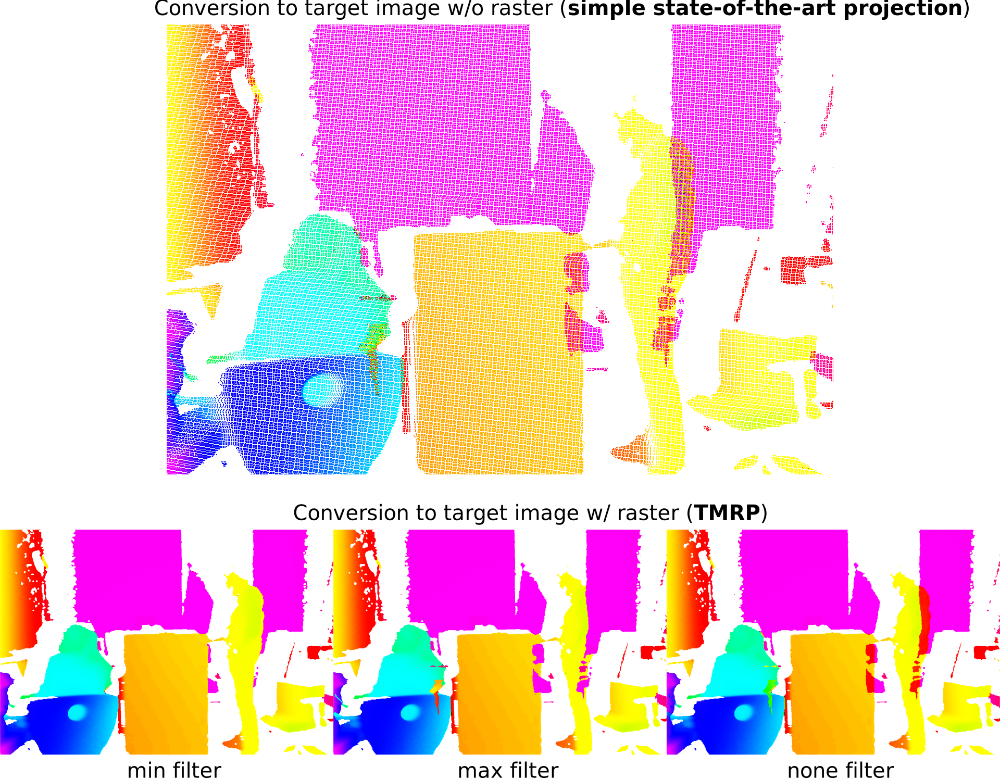

# Triangle-Mesh-Rasterization-Projection

This program converts 3D point clouds in PLY file format to 2D image data in BBF or PNG file format.<br>
It includes two different methods:
- **Triangle-Mesh-Rasterization-Projection (TMRP):** A new way to project point clouds into a dense accurate 2D raster image
- **simple state-of-the-art projection**

## Paper

The method and possible applications are described in our paper.<br>

Paper is accessible [here (soon)]()...

## Documentation

The `ply2image` app is a command line tool. Use `ply2image --help` to display the usage help.

For this, two of the PLY properties are interpreted as x and y pixel coordinates for the 2D image. A third PLY property is interpreted as the value of this pixel.

By default, the x, y and z properties of the vertex element are used. This corresponds exactly to the conversion of a 3D point cloud into a depth map.

The values of the properties can be scaled. Before and after scaling, the values can be moved. The shift before scaling takes place in the unit of the property. The shift after scaling takes place (for x and y) in 2D pixels. The shift before and after scaling is of course equivalent via the scaling factor. That both are offered is purely a convenience function.

Since the 3D coordinates X and Y are usually not integers, in the 2D image the Z value must be distributed among the surrounding four 2D pixels. If neighboring 3D X/Y coordinates are further than one unit apart, then there will be gaps between these pixels in the 2D image. With almost all 3D measurement methods, 2D neighborhood information of the 3D coordinates can simultaneously be acquired. It is strongly recommended to always save them with the PLY file and to keep them even in case of global transformations of the 3D points. If this information is available in x and y direction as a property of the PLY file, it can be used to perform a dense interpolation between the 2D pixels that were adjacent in 3D. This results in gaps in the 2D image only if the original measurement of the 3D data had also detected a gap. The 2D raster must contain integer values only. By default it is assumed to be specified in the PLY properties raster_x and raster_y. If one of these properties is not found in the PLY file, the program prints a warning and performs the conversion without raster interpolation. Raster interpolation can be switched off explicitly.

The raster information can also be used to cleanly separate foreground and background. This is especially useful for point clouds that have been transformed, as overlaps are very likely to occur. In marginal areas, however, this may already be the case without transformation. For filtering, the minimum or maximum value is determined as a reference value in the target pixel. Only values that are adjacent to this reference value in the raster are included in the target pixel. By default, the minimum is used, which corresponds to a foreground selection for Z values. (The smaller the value, the closer the pixel was to the acquisition system).



By default, the output image is stored in BBF file format with 64-bit floating point values in the native byte order of the program's current execution environment. Empty pixels are encoded as NaN (Not a Number). The BBF specification is linked above. It is a simple raw data format with a 24 bytes header.

Saving as PNG is lossy! The output is always a 16 bit grayscale image with alpha channel. The pixel values range is truncated to 0 to 65535, no overflow or underflow takes place! All pixel values are rounded half up to integers. Fixed point values can be emulated via the value scaling. For example, to emulate 4 binary decimal places, the scaling must be set to 16 (=2^4). However, this information is not stored in the image! So when reading the PNG file later, you have to take care by yourself to interpret the values as fixed-point numbers again!

## Usage

```
mkdir build
cd build
cmake ..
make
```

```
./ply2image
```

## Licence

See [license](LICENSE.txt)

**Reference**

If you use our Software in your academic work or project, please cite our paper:

```
@article{Junger23,
      title={{Triangle-Mesh-Rasterization-Projection (TMRP): An algorithm to project a point cloud into a consistent and dense accurate 2D raster image}},
      author={Junger, Christina and Buch, Benjamin Roland and Notni, Gunther},
      journal = {Measurement: Sensors; Multimodal Data Fusion Technologies and Applications in Intelligent System},
      note = {submitted on 04.07.2023; proofread on 07.08.2023},
      year={2023}
}
```

## Funding

This research was funded by the Carl-Zeiss-Stiftung as part of the project [Engineering for Smart Manufacturing](https://www.e4sm-projekt.de/) (E4SM) – Engineering of machine learning-based assistance systems for data-intensive industrial scenarios.
